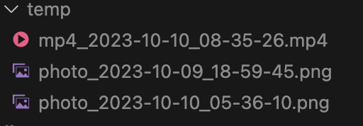
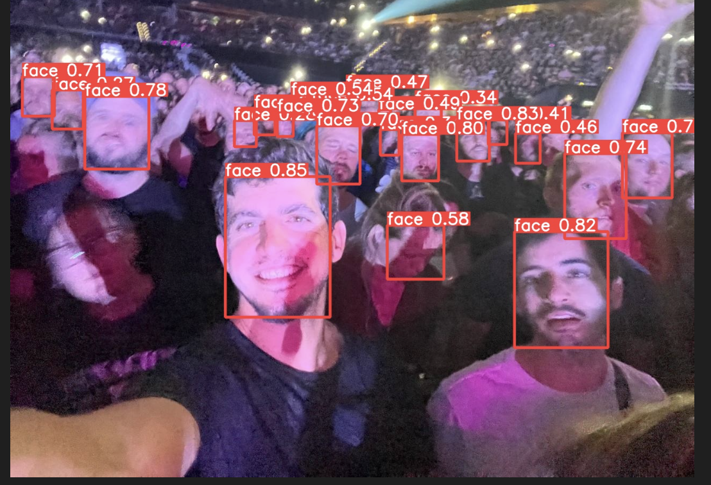
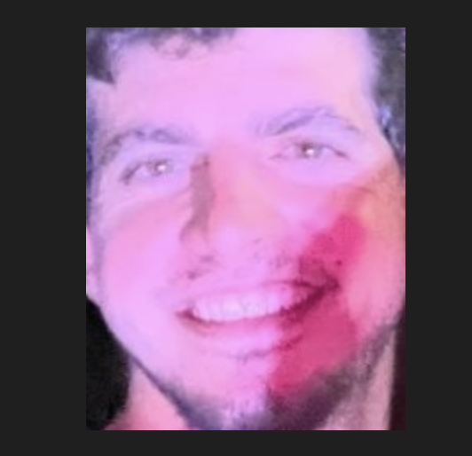

# INFO

This is an AI Project that should help identify faces in videos & Images

--- 
## TL;DR
* Start your telegram bot
[Create application in telegram](https://core.telegram.org/api/obtaining_api_id)
* Choose TL channel `@YourChannelName`
* Downoload all videos and Images

* The AI face recognition cepabilities will extract the faces of the video participants 

--- 
# Installaiton
Install requirements: `pip install -r requirements.txt`
